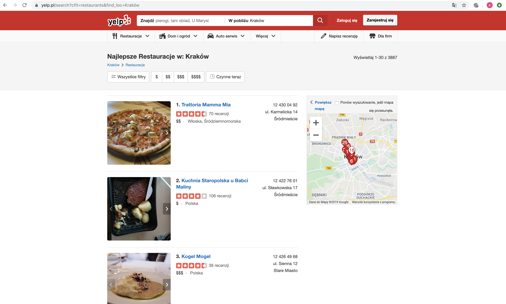

# Today's project demo

In this workshops we will build an restaurant-review application which:

* Display restaurants list with user's feedback:
  * handling veery long list on main page
  * display single restaurant on page with reviews
  * allow users to post reviews
  * browse other's reviews
* User login and authentication - users can post their reviews
* Error handling - we will care about errors :\)

Example production ready app will look like this :\)

